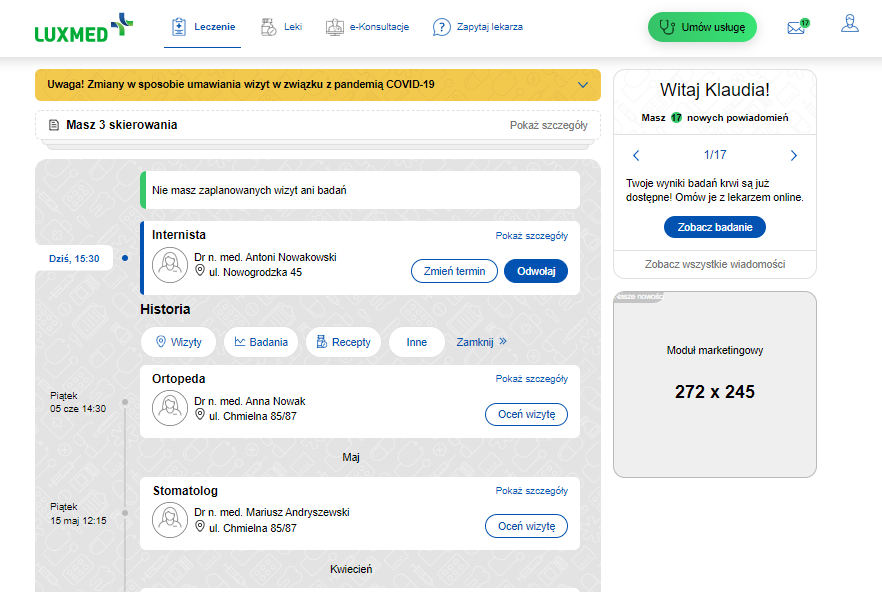

# Patient - project based on Figma during a recruitment process I am taking part in. 
It is for desktop view (512px or more) and mobile (below 512px).

## The tools which were used here:

* Figma
* Flexbox
* SASS
* Visial Studio Code
* git
* ...

To run:

1. git clone https://github.com/kakuliniec/patient.git
2. Npm install
3. Npm start

**E n j o y !** 😉 

